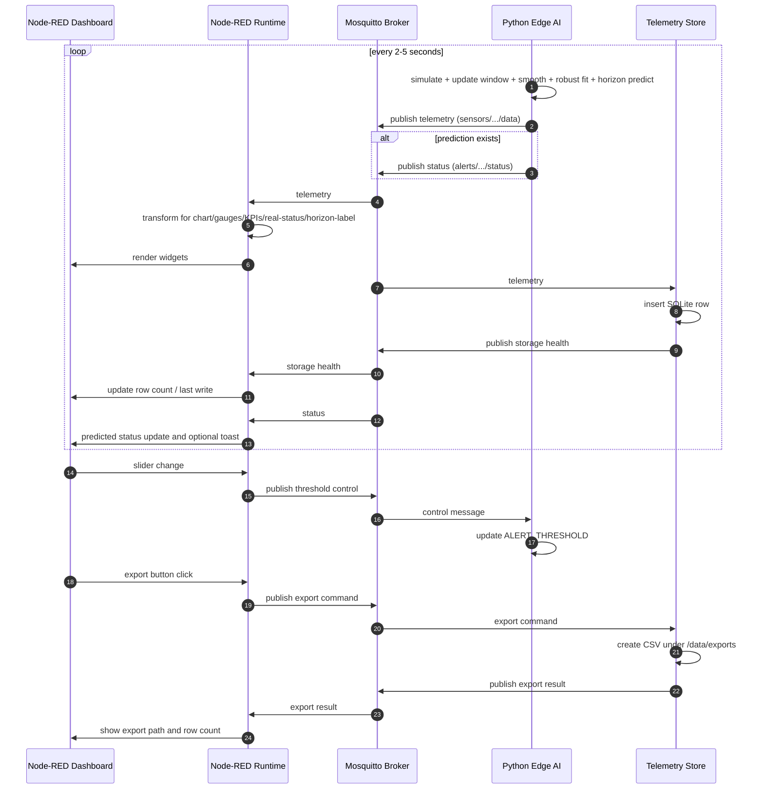

# System Architecture and Dataflow

## 1. System Objective

The project implements an edge-oriented predictive monitoring pipeline for industrial temperature signals.

Primary objective:

- Estimate temperature about 60 seconds into the future from recent observations.
- Detect forecasted threshold violations early.
- Expose real-time telemetry, health state, and control in a dashboard.

## 2. High-Level Architecture

The system consists of four runtime services connected through MQTT.

1. Python Edge AI service
Role: Simulates temperature, performs prediction, publishes telemetry and alerts.

2. Mosquitto broker
Role: Message bus for telemetry, alerts, and control commands.

3. Node-RED service
Role: Subscribes to MQTT topics, transforms payloads, renders dashboard, and publishes control updates.

4. Telemetry Store service
Role: Subscribes to telemetry, writes SQLite records, serves query/export utilities, and publishes storage health/export results.

## 3. Container Topology

Defined in docker-compose.yml:

- Service: mqtt
  - Image: eclipse-mosquitto:2.0
  - Port: 1883
  - Volume: broker config, persistent data, log storage

- Service: node-red
  - Build context: node-red/
  - Port: 1880
  - Volume mount: node-red/flows.json to /data/flows.json
  - Depends on mqtt

- Service: python-edge
  - Build context: python/
  - Environment variables: MQTT_BROKER, PREDICTION_HORIZON_SEC, AVG_SAMPLE_INTERVAL_SEC, WINDOW_SIZE, FORECAST_SMOOTHING_ALPHA, OUTLIER_MAD_SCALE, MAX_FORECAST_SLOPE_PER_STEP, FORECAST_VOLATILITY_MULT, FORECAST_MIN_DELTA_C, FORECAST_MAX_DELTA_C
  - Depends on mqtt

- Service: telemetry-store
  - Build context: storage/
  - Environment variables: MQTT_BROKER, MQTT_PORT, TELEMETRY_TOPIC, HEALTH_TOPIC, EXPORT_CMD_TOPIC, EXPORT_RESULT_TOPIC, DB_PATH
  - Volumes: telemetry_data for database, bind mount ./storage/exports to /data/exports for project-local CSV output
  - Depends on mqtt

## 4. Runtime Message Flow

### 4.1 Primary telemetry flow

1. Python generates one synthetic sample.
2. Python updates its sliding window.
3. Python predicts about 60 seconds ahead using stabilized linear extrapolation when enough history is available.
4. Python publishes telemetry JSON to sensors/group_33/project33/data.
5. Node-RED receives telemetry and fan-outs to chart, gauges, KPI logic, and real-temperature status logic.

### 4.2 Alert flow

1. Python compares predicted value with active threshold.
2. Python publishes status to alerts/group_33/project33/status.
3. Node-RED receives status and updates predicted operational status text.
4. For CRITICAL, Node-RED emits a toast notification.

### 4.4 Real temperature status flow

1. Node-RED computes operational status directly from actual_temp versus threshold from telemetry.
2. Node-RED updates a dedicated real-temperature operational status label.

### 4.5 Horizon indicator flow

1. Python includes prediction_horizon_sec in telemetry.
2. Node-RED displays this as a label such as 60 seconds ahead.

### 4.6 Persistence flow

1. Telemetry Store subscribes to sensors/group_33/project33/data.
2. Service writes predicted and actual values to SQLite table telemetry.
3. Service publishes row count and last-write info to storage/group_33/project33/health.

### 4.7 CSV export flow

1. User clicks Export Last 60m CSV in Node-RED dashboard.
2. Node-RED publishes command to storage/group_33/project33/export.
3. Telemetry Store runs export and writes CSV to /data/exports (mapped to project storage/exports).
4. Telemetry Store publishes result payload to storage/group_33/project33/export/result.
5. Node-RED displays export result text (path and row count).

### 4.3 Control flow

1. User moves threshold slider in dashboard.
2. Node-RED publishes control JSON to controls/group_33/project33/threshold.
3. Python subscribed callback reads threshold and updates ALERT_THRESHOLD in memory.
4. Subsequent alert decisions use the new threshold immediately.

## 5. Data Lifecycle in One Iteration

For each loop iteration in Python:

1. Simulate temperature and anomaly flag.
2. Append sample to history.
3. Trim history to window size.
4. Predict future value and slope at the configured horizon if history is full.
5. Derive trend label from slope.
6. Compute rolling average and horizon metadata.
7. Publish telemetry payload.
8. Publish alert payload (NORMAL or CRITICAL) when prediction exists.
9. Sleep random interval between 2 and 5 seconds.

## 6. Sequence Diagram

## 7. Reliability and Failure Handling

Current behavior:

- Python reconnects on MQTT disconnect via callback.
- Docker restart policy is always for all services.
- Node-RED and Python both depend on broker service in compose.

Operational implications:

- Broker restart can cause temporary telemetry gap.
- Python loop catches generic exceptions and retries after short delay.
- Dashboard recovers automatically when MQTT stream resumes.

## 8. Security Posture (Current)

Current broker config allows anonymous clients and plain MQTT on 1883.

This is acceptable for local class/lab use only.
For production, enforce:

- Authn/authz
- TLS transport
- Network segmentation
- Topic ACLs

## 9. Extension Points

Best extension boundaries:

- Replace synthetic source with real sensor input in Python service.
- Swap regression model without changing topic contracts.
- Add cloud-forwarding service subscribing to existing alert topic.
- Extend storage service with retention policies and periodic archival without touching producer/consumer logic.
